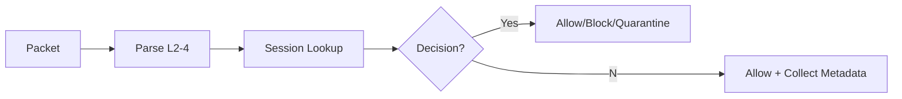
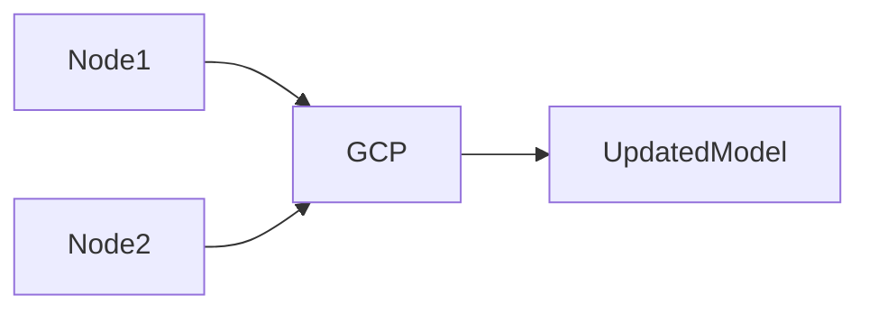

# 🛡 **Neurawall — AI-Driven Next-Generation Firewall (NGFW)**

> **Inline • AI-Augmented • Real Traffic Tested • Federated Intelligence**

---

## 📖 Table of Contents
1. [Problem Statement](#-problem-statement)
2. [Design Philosophy](#-design-philosophy)
3. [Architecture](#-high-level-architecture)
4. [Packet Pipeline](#-inline-packet-processing)
5. [Sessions & First-10 Rule](#-first-10-packet-decision-strategy)
6. [Feature Engineering](#-feature-engineering)
7. [ML & Detection](#-machine-learning--anomaly-detection)
8. [IDS & SOAR](#-ids--malware-detection-suricata)
9. [Federated Learning](#-federated-learning-gcp)
10. [Database Schema](#-database-schema)
11. [Dashboards](#-dashboard--observability)
12. [Testing & Performance](#-testing-realism--performance)
13. [Tech Stack](#-tech-stack)
14. [Future Work](#-future-work)
15. [Team](#-team)
16. [Deployment](#-deployment)

---

## 🚩 Problem Statement
Traditional security fails because:
- Firewalls can’t adapt to new threats
- Signature IDS misses zero-days
- Offline ML ≠ usable inline
- Encrypted traffic hides payloads
- Human response is too slow

**Neurawall = Inline enforcement + Behavioral ML + IDS overrides + SOAR automation.**

---

## 🎯 Design Philosophy
- 🧱 **Inline first** — real packets, real decisions
- 🧠 **ML + IDS + SOAR fusion**
- 🚪 **Fail-Open safety**
- 🔁 **Continuous reassessment (30s)**
- 🔎 **TLS visibility (JA3/SNI) without breaking encryption**

---

## 🧠 High-Level Architecture

📌 **Always in-path**, not mirrored.

---

## 🔁 Inline Packet Processing


**Key**: No buffering, no packet replay, decisions apply live.

---

## 🚀 First-10-Packet Decision Strategy
| Packets | Action |
|---------|---------|
| 1–10 | Always allowed; profile only |
| 11+ | Feature extraction → ML → enforce |

🔐 Prevents false positives from TLS handshakes.

---

## 📊 Feature Engineering
**Transport**: IAT, burst patterns, packet ratios  
**TCP**: TTL/seq anomalies, retransmissions  
**L7 (if visible)**: URL/method, DNS, commands  
**Encrypted**: JA3, SNI, ciphers, cert metadata

---

## 🤖 Machine Learning & Anomaly Detection
Pipeline:


Detection modes:
- Plaintext → L7 + ML + IDS
- TLS/SSH → Metadata (JA3/SNI) + ML
- Blind → Behavioral ML

---

## 🛡 IDS & Malware Detection (Suricata)
If ML says **allow** but IDS hits a signature → **block override**.

SOAR Actions:
- 🚫 Block (iptables)
- 🔐 Quarantine (LOG+DROP 24h)
- 📩 Alert (email/ticket)

---

## 🧬 Federated Learning (GCP)
Nodes send **model weights**, not traffic.

Benefits:
- No PII
- No payload sharing
- Global intelligence sync



---

## 🗄 Database Schema
| Table | Purpose |
|-------|----------|
| `sessions` | Flow state & final decisions |
| `flow_features` | Metadata + timing |
| `ti_metadata` | Reputation + feed |
| `soar_actions` | Automated responses |

---

## 📊 Dashboard & Observability
Built with Streamlit:
- Active sessions + risk
- IDS hits + signatures
- SOAR logs
- TLS fingerprints
- Heatmaps & anomaly timelines

---

## 🧪 Testing, Realism & Performance
| Test | Result |
|------|---------|
| Throughput | **~1.2 Gbps** |
| IDS override latency | **<30ms** |
| First-10 rule | No drops |
| TLS visibility | JA3/SNI confirmed |
| Fail-open | Verified |

Tested in **GNS3** with real routing & failures.

---

## ⚙️ Tech Stack
**Python** · Linux TAP/Raw Sockets · Suricata · Scikit-Learn  
**Streamlit** · SQLite · GCP (Federated) · iptables

---

## 🚀 Future Work
- RL-based adaptive policy engine
- Rust/C++ dataplane
- Helm/Terraform deployment
- Intelligence feed ingestion
- Distributed inference

---

## 👨‍💻 Team
| Name | Role |
|------|------|
| Ketan Dav | Lead / Architect |
| Chinmay Patel | ML / Backend |
| Ankit Chauhan | Network / IDS |
| Kavya Desai | UI & Dashboards |
| Aastha Shah | QA / Research |

---

## 📎 Deployment
```
Router ↔ TAP0 ↔ Neurawall ↔ TAP1 ↔ Core
```

> **If it can’t run inline on real traffic, it’s not a firewall.**
